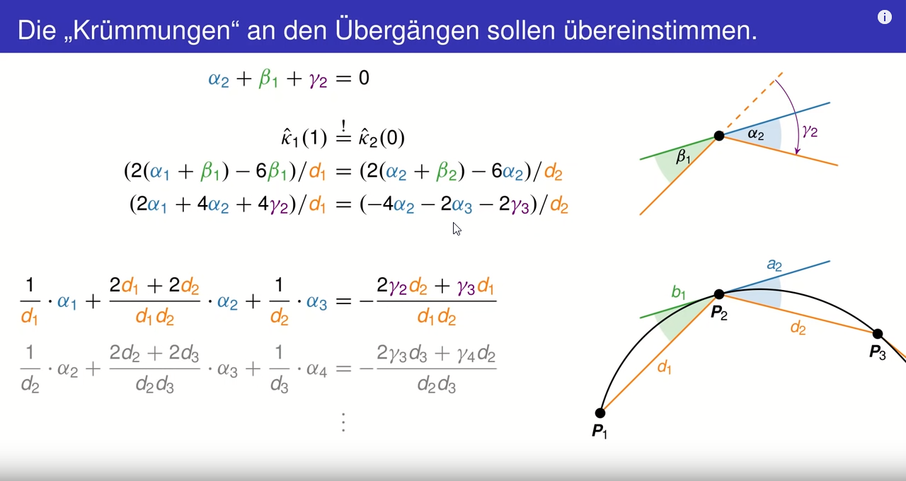
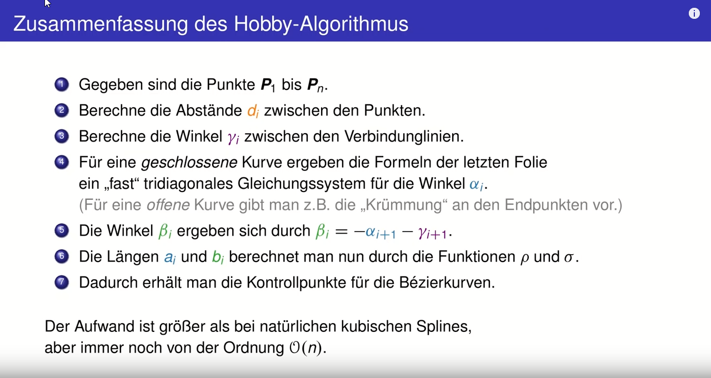

# albatross

This repository contains my research project on autonomous driving for small RC-vehicles.

## Object Detection (*done)

Yolov3 is used to detect the cups which represent the waypoints.

## World Transform (*done)

The detected cups (in the picture) are projected onto a two dimensional plane to obtains the world coordinates.

## Hobby Algorithm (*in progress)

The Hobby Algorithm [[1]](#1) will be used to interpolate the single waypoints.

This video (german) provides a good starting point: https://www.youtube.com/watch?v=DrjdI3x3PYQ

## Some next step

# Link collection

- OpenCV with PyQT:
  
  http://kurokesu.com/main/2016/08/01/opencv-usb-camera-widget-in-pyqt/

- Hobby Algorithm:

  https://www.youtube.com/watch?v=DrjdI3x3PYQ

## References
<a id="1">[1]</a> 
Hobby, J.D.
Smooth, easy to compute interpolating splines. 
Discrete Comput Geom 1, 123–140 (1986).
https://doi.org/10.1007/BF02187690